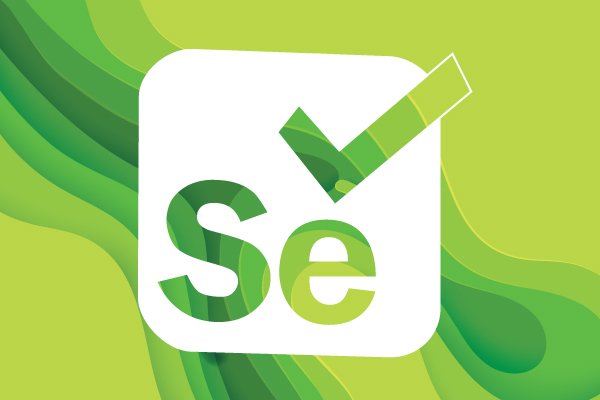

# webscraping
       

   # 

## What is web scraping?
• Web scraping is the process of collecting structured web data in an automated fashion. It’s also called web data extraction. Some of the main use cases of web scraping include price monitoring, price intelligence, news monitoring, lead generation and market research among many others.

• In general, web data extraction is used by people and businesses who want to make use of the vast amount of publicly available web data to make smarter decisions.

• If you’ve ever copy and pasted information from a website, you’ve performed the same function as any web scraper, only on a microscopic, manual scale. Unlike the mundane, mind-numbing process of manually extracting data, web scraping uses intelligent automation to retrieve hundreds, millions, or even billions of data points from the internet’s seemingly endless frontier.

## Tools used for Scrapping the data

#### 1. Beautiful Soup
Beautiful Soup is a Python package for parsing HTML and XML documents. It creates a parse tree for parsed pages that can be used to extract data from HTML, which is useful for web scraping.
 # 
 
#### 2. Selenium Webdriver
Selenium is a Python library and tool used for automating web browsers to do a number of tasks. One of such is web-scraping to extract useful data and information that may be otherwise unavailable.
# 
 

## Websites list of scraped data

• wikipedia link- https://en.wikipedia.org/wiki/Main_Page

• Imdb link-      https://www.imdb.com/

• Bookpagelink-   www.bookpage.com

• ICC link-       www.icc-cricket.com

• Weather link-   https://www.weather.gov/ 

• Amzon link-     https://www.amazon.in/s?k=phone+under+20000&ref=nb_sb_noss_1
